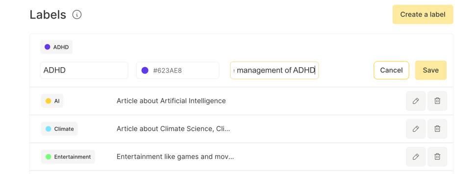
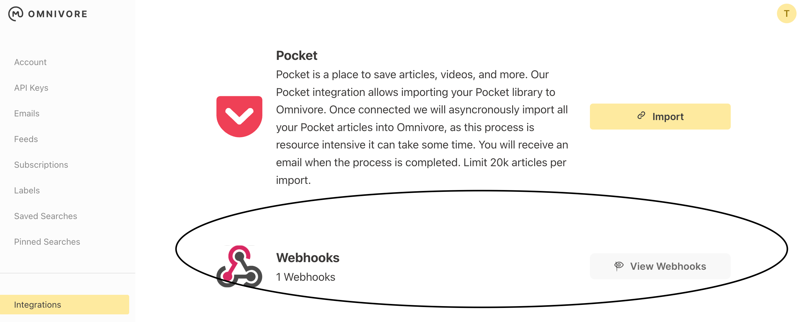
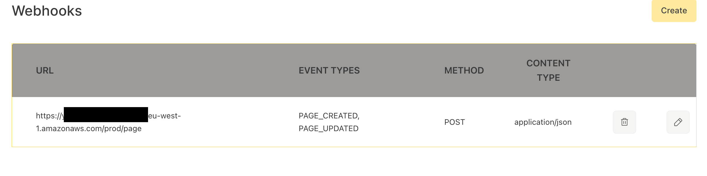

# Omnivore Automatic Labelling

This project aims to implement automatic labeling using Omnivores built in Webhook Functionality and Open AI's Embedding API.

This repository provides a way to deploy this via AWS using API Gateway, and Lambda. I also have included a Fastify Docker Image that can be deployed to any webserver.

## Improving labeling Accuracy: 

Labeling accuracy can be improved by providing a small description in your Label in omnivore. This provides more context to the embedding model.



Note that the embedding uses the Articles Description to try to automatically label. 

## Labeling Filtering

There is an included filter list in the `src/resources/config.ts` 

This currently filters the RSS Tag, and Newsletter tag. These are system defaults and rarely used. 

You can also add your own tags into here to avoid

## Labeling Strategies 

Provided are 3 different labeling Strategies. These can be changed in `src/resources/config.ts`

### PERCENTAGES

This is the default method. 

It uses a set of percentages to add labels.

```
{
    "percentage": 0.9,
    "maxLabels": 5
},
```

The above would allow you to have 5 labels added if the similarity percentages between that label, and the article is 90%


### HIGHEST_SIMILARITY

This adds the `maxLabels` number of Labels to each article.

It always adds the highest % similarity. 

### PER_LABEL_PERCENTAGE

This allows you to set individual percentages per tag. If the tag is not in the list, or is below the threshold it will not be added. 


## Technology

* OpenAI Embedding Models
* Omnivore API 
* AWS Api Gateway
* AWS Lambda 
* DynamoDB (Storage to avoid constantly recalculating the embedding) 

## How to Deploy 

The AWS CDK is used to simplify deployment. This requires you to have an AWS Account. 

``npx cdk deploy -c open_api_key=<OPEN_AI_API_KEY> -c omnivore_auth=<OMNIVORE_API_KEY>``

This will provide an API Gateway, the endpoint will be the API Gateway Endpoint /page

This can then be added in the Omnivore Webhook






## TODO: 

I need to add updated labels. At the moment in the deployed version the only way to update the labels is to delete them from DynamoDB. In the hosted version it would be to restart the server. It does not currently add new labels, but we could add this later.

